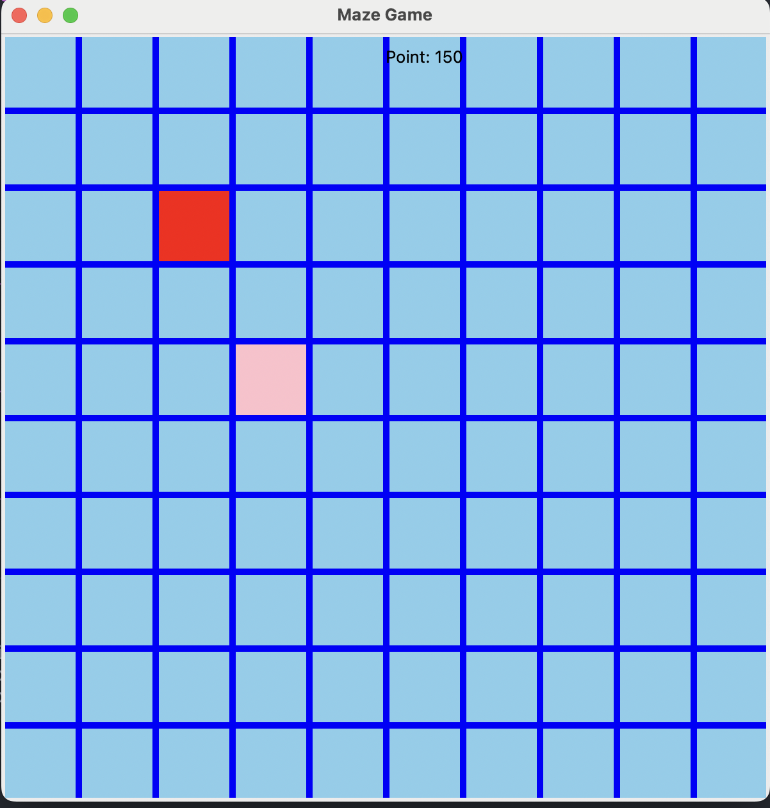

# Maze Game

## Description

This is a simple tag game implemented in Python using the Tkinter library. The player navigates through a maze, collects apples, and earns points. The game features a moving apple and tracks the player's points.

## Features

- **Player Controls:** Use the arrow keys (Up, Down, Left, Right) to navigate the player through the maze.
- **Collect Apples:** The player can collect apples to earn points.
- **Moving Apple:** The apple moves randomly within the maze.

<p align="center">
  
</p>

## Instructions

1. Run the script in a Python environment.
2. Use the arrow keys to navigate the player.
3. Collect apples to earn points.
4. Press 'Q' to quit the game.

## Dependencies

- Python 3.x
- Tkinter Library

## How to Run

```bash
python maze_game.py
